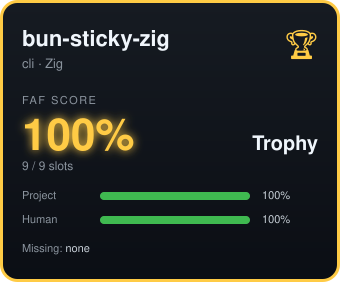

<p align="center">
  <pre>
   ▄▄       ▄▀▀▀ ▀█▀ █ ▄▀▀ █▄▀ █ █
  ████      ▀▀█▄  █  █ █   █▀▄  █
██████      ▄▄▄▀  █  █ ▀▀▀ █ █  █
████████
████████    █▀▄  █ █ █▀▄   ▀▀█ █ ▄▀▀
 ██████     ██▀  █ █ █ █   ▄ ▀ █ █ ▄
   ████     █▄▀  ▀▄▀ █ █   █▄▄ █ ▀▀█
     ▀▀
  </pre>
</p>

<h1 align="center">bun-sticky</h1>

<p align="center">
  <b>Fastest bun under the sum.</b><br>
  Zig-native FAF CLI. Zero dependencies. Wolfejam slot-based scoring.
</p>

<p align="center">
  
</p>

<p align="center">
  <i>This card is its own dogfood — generated by <code>faf --svg</code> scoring this repo.</i><br>
  <a href="https://github.com/Wolfe-Jam/bun-sticky-zig"></a>
</p>

<p align="center">
  <a href="#install">Install</a> •
  <a href="#usage">Usage</a> •
  <a href="#scoring">Scoring</a> •
  <a href="#tiers">Tiers</a> •
  <a href="CONTRIBUTING.md">Contributing</a>
</p>

---

## Install

```bash
curl -fsSL https://raw.githubusercontent.com/Wolfe-Jam/bun-sticky-zig/main/install.sh | bash
```

Or build from source:

```bash
git clone https://github.com/Wolfe-Jam/bun-sticky-zig
cd bun-sticky-zig
./verify
```

**77KB binary. Zero runtime dependencies.**

Bun is built on Zig ⚡️ — so we did that too. Also available as a [TypeScript package on npm](https://npmjs.com/package/bun-sticky) — 1,100+ downloads.

> **The `faf` command.** bun-sticky installs as **`faf`** — the same command as the full [faf-cli](https://npmjs.com/package/faf-cli), and both score `.faf` files identically. If you have *both* installed, your PATH decides which runs (Homebrew will note that it's shadowed) — `faf score` works either way. bun-sticky is the **lite, zero-dependency, native** scorer; for the full toolchain (`taf`, `auto`, `go`, sync, …) use faf-cli. Same family, same `.faf`, same scores.

## Usage

```bash
cd any-project        # Go to any repo/directory
faf score             # Score the project.faf
```

Or create one:

```bash
faf init myapp        # Create project.faf
faf score             # Score it
faf sync              # Sync to CLAUDE.md
faf help              # Show commands
```

**v1.1 — CI & badges:**

```bash
faf score --json      # Machine-readable JSON (CI / automation)
faf score --badge     # Paste-ready shields.io README badge
faf score --min 85    # Exit non-zero if score < 85 (CI gate)
```

Drop the badge in your README — `faf score --badge` prints the markdown, paste it, done.

**Cards — view your context the fun way:**

```bash
faf --svg              # Embeddable SVG score card (the dark card above)
faf --print            # Standalone HTML card
faf --ascii            # Terminal card
faf grab               # Parsed .faf as JSON — build your own tools with context
```

The SVG card is self-contained (no shields dependency), tier-colored as a rarity border, and embeds anywhere an `` does. Pipe it to a file and commit it: `faf --svg > assets/faf-card.svg`.

## Why Zig?

**Bun is built on Zig.** This CLI speaks Bun's native language.

| Feature | bun-sticky |
|---------|-----------|
| Binary size | 77KB |
| Dependencies | 0 |
| Cold start | <1ms |
| Cross-platform | ✓ |

## Scoring

**Wolfejam Slot-Based Scoring** - 21 slots across 5 categories:

| Category | Slots | Fields |
|----------|-------|--------|
| Project | 3 | name, goal, main_language |
| Frontend | 4 | frontend, css_framework, ui_library, state_management |
| Backend | 5 | backend, api_type, runtime, database, connection |
| Universal | 3 | hosting, build, cicd |
| Human | 6 | who, what, why, where, when, how |

**Type-aware**: CLI uses 9 slots, Fullstack uses all 21.

```
Score = Filled Slots / Applicable Slots × 100
```

## Tiers

| Score | Tier | |
|-------|------|---|
| 100% | Trophy | 🏆 |
| 99%+ | Gold | ★ |
| 95%+ | Silver | ◆ |
| 85%+ | Bronze | ◇ Production ready |
| 70%+ | Green | ● |
| 55%+ | Yellow | ● |
| <55% | Red | ○ |

**🥐 Big Croissant** — the Michelin Star for repos: an *honor*, not a score. Awarded by AI/human for excellence at the top of the ladder. Can't be calculated; 100% is the max score.

## Testing

```bash
zig build test --summary all    # 150/150 tests passed
```

Certified by the **[WJTTC suite](tests/WJTTC-TEST-SUITE.md)** — F1-tiered: ENGINE (core logic), LIVERY (card rendering), BRAKE (safety/escaping), AERO (14k-iteration fuzz + determinism).

## FAF Ecosystem

| Package | Runtime | Install |
|---------|---------|---------|
| [faf-cli](https://npmjs.com/package/faf-cli) | Node.js | `npm i -g faf-cli` |
| [bun-sticky-faf](https://npmjs.com/package/bun-sticky-faf) | Bun | `bunx bun-sticky-faf` |
| **bun-sticky-zig** | Native | `curl -fsSL .../install.sh \| bash` |
| bun-sticky-zig-plus | Native | Color ASCII, bi-sync, --json (paid) |

## Best Context Under the Bun

**faf-cli v5.0.6** aligned the full FAF toolchain with Bun as a first-class runtime. bun-sticky-zig is the technical credibility layer beneath it all — a pure Zig parser running native inside the ecosystem that Bun itself is built on.

Bun chose Zig. This parser speaks that same language. No transpilation, no runtime, no dependencies. Just Zig reading YAML at the speed of the metal.

For the full CLI toolchain — `init`, `auto`, `go`, `bi-sync`, `tri-sync`, and 30+ commands — run:

```bash
bunx faf-cli auto       # Zero to 100% in one command, native on Bun
bunx faf-cli init       # Create .faf from your local project
bunx faf-cli go         # Guided interview to gold code
```

bun-sticky-zig is the Zig showcase: proof that FAF parses at the lowest level of the stack. faf-cli is the full toolchain: everything you need to score, sync, and ship.

Read more: [Best Context Under the Bun](https://faf.one/blog/best-context-under-the-bun) — the full story on FAF + Bun alignment.

---

### 🏎️ The FAF · Zig family
*Bun is built on Zig ⚡ — so are we.*

- **[ZEPH💨](https://github.com/Wolfe-Jam/xai-faf-zeph)** — Zig → WASM context engine (UCL), 2.7 KB
- **[bun-sticky-zig](https://github.com/Wolfe-Jam/bun-sticky-zig)** — Zig-native FAF CLI, 77 KB, zero deps
- **[bun-sticky](https://npmjs.com/package/bun-sticky)** — the TypeScript FAF CLI (npm)
- **[.faf](https://faf.one)** — the IANA-registered context format (FAF🐘)

## License

MIT

---

<p align="center">
  <i>Zero dependencies. Pure Zig. Wolfejam slot-based scoring.</i><br>
  <i>The poster child FAF CLI for Bun/Anthropic.</i>
</p>
